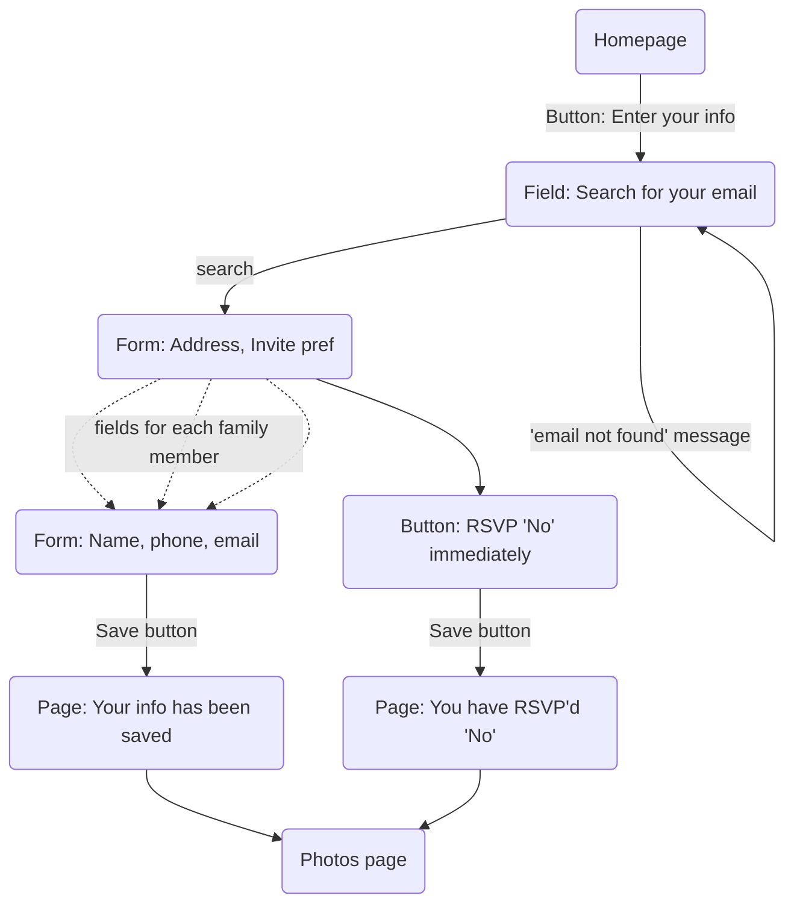

Getting family addresses etc

```mermaid
graph TD;

home(Homepage)

getPersonEmail(Field: Search for your email)

getFamilyInfo(Form: Address, Invite pref)
getPersonInfo(Form: Name, phone, email)
respondNo(Button: RSVP 'No' immediately)
infoSavedConfirmed(Page: Your info has been saved)
photosPage(Photos page)
respondNoConfirmed(Page: You have RSVP'd 'No')

home -- Button: Enter your info --> getPersonEmail

getPersonEmail -- 'email not found' message --> getPersonEmail

getPersonEmail -- search --> getFamilyInfo

getFamilyInfo  -.-> getPersonInfo
getFamilyInfo  -. fields for each family member -.-> getPersonInfo
getFamilyInfo  -.-> getPersonInfo

getFamilyInfo --> respondNo

getPersonInfo -- Save button --> infoSavedConfirmed

infoSavedConfirmed --> photosPage

respondNo -- Save button --> respondNoConfirmed

respondNoConfirmed --> photosPage

```